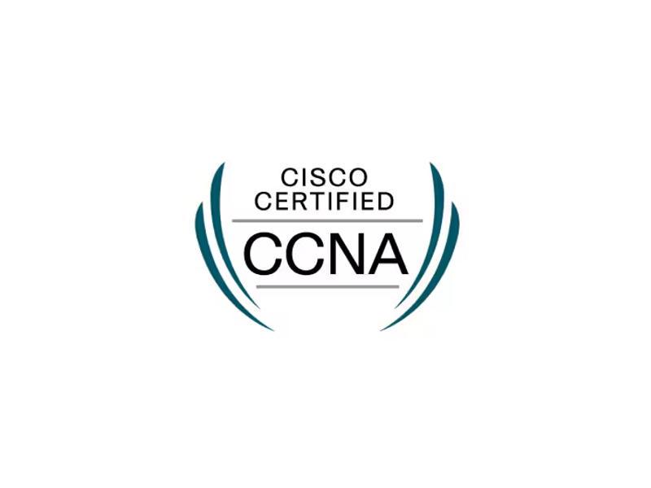

  

 

# 🐧 $ whoami 

My name is **Fahad Mutlaq Alharbi**. I hold a **Bachelor of Science in Information Technology**, heavily specializing and focusing on **Cloud Infrastructure and Security**. I am a Cloud Infrastructure Engineer dedicated to architecting, securing, and automating resilient network environments. ☁️

<table>
  <tr>
    <td style="border: 1px solid #30363d; background-color: #0d1117; padding: 15px; border-radius: 6px;">
      
        “Complexity is the ultimate enemy of security. In modern cloud infrastructure, if a core architecture configuration isn't automated, version-controlled, and continuously monitored, it cannot be truly secured.”
      
        
      
<em>- Cloud Architecture Principle</em>

    </td>
  </tr>
</table>

---

### 🛠️ Technologies and tools

* 💻 **Operating Systems & Setup**  
   

* 🌐 **Networking, Routing & Automation**  
       

* ⚙️ **Web Servers & Services**  
     

* 📊 **Monitoring & Observability**  
   

* ⛓️ **Version Control**  
   

---

### 📖 What I am currently learning / improving on

* ☁️ **Cloud Computing & Advanced Networking Core**  
    

* 🐳 **Containerization & Web Server Infrastructure (3-Week Deep Dive)**  
   

---

### 👾 What I am interested in learning at some point

* 🚀 **DevSecOps & Infrastructure as Code**  
    

---

### 📂 Featured Projects

<table width="100%">
  <tr>
    <td width="50%">
      
    </td>
    <td width="50%">
      
    </td>
  </tr>
</table>

---

### 📜 Verified Certifications & Progress Roadmap

<table width="100%">
  <tr>
    <td width="50%" align="center" valign="middle" style="border: 1px solid #30363d; padding: 15px; border-radius: 6px; background-color: #0d1117;">
      <strong>🏆 Achieved Certifications</strong>
      

       
      

        
          
        Cisco Certified Network Associate
      

    </td>
    <td width="50%" valign="top" style="border: 1px solid #30363d; padding: 15px; border-radius: 6px; background-color: #0d1117;">
      <strong>⚡ In-Progress Roadmap</strong>
      

       
      📌 <strong>CompTIA Security+</strong>  
      <code>Progress:</code> [██████████░░░░░░░░░░] 50%  
        
      📌 <strong>AWS Solutions Architect (SAA-C03)</strong>  
      <code>Progress:</code> [████░░░░░░░░░░░░░░░░] 20%  
      • Core VPC &amp; Cloud Security Networking
    </td>
  </tr>
</table>

---

### 📮 Where to find me

 
